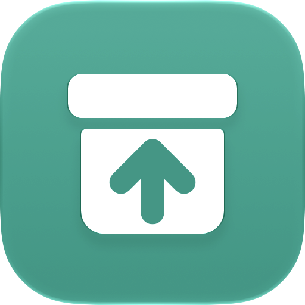

# quickUschovna

Drop files on the menu bar, get an [Úschovna](https://www.uschovna.cz) link.

Úschovna is a Czech service for sending files that are too big for email or chat, up to 30 GB
for free. Sending through the website means opening a browser, loading the page, typing your
email, adding the files and waiting for the link. quickUschovna is a macOS menu-bar app that
does it in one move: drag files onto its icon, and when the upload finishes the link is on your
clipboard. You type your email once, in its settings.

## Install

1. Download the `.dmg` from [the latest release](https://github.com/Luksanss/quickUschovna/releases/latest),
   open it, and drag quickUschovna onto Applications.
2. Open it. The first time, macOS blocks it because it isn't notarized: go to System Settings →
   Privacy & Security and click Open Anyway.
3. To send from Finder's right-click menu too, turn the Quick Action on once: right-click any file,
   choose Quick Actions › Customize…, and tick Send with Úschovna. macOS adds other apps' Quick
   Actions switched off.

It needs macOS 27.

quickUschovna doesn't check for updates itself. To update, download the latest release the same
way and replace the app in Applications.

## Use

- **Drag files towards the menu-bar icon.** As the drag gets close, a drop zone opens under the
  icon; drop them there, or on the icon itself. The first time, it asks for your email address,
  the package's sender.
- **Or in Finder,** select files and folders, right-click, and choose Quick Actions › Send with
  Úschovna.
- **When the upload finishes, the link is on your clipboard,** and a bubble under the icon says so.
  Click the bubble to open the link.

Everything in one drop goes as one package with one link. Folders are zipped first, without
compression, so it's quick. Over 30 GB is refused before anything is sent. If the network drops,
the upload waits and carries on where it stopped.

Click the icon for what's sending, the links you sent in the last 14 days (click one to copy it
again), your sender address, Launch at Login and Quit.

## Build

Open `quickUschovna.xcodeproj`, choose your own team under Signing & Capabilities for both targets
(a free Personal Team works), and build the quickUschovna scheme. `scripts/uschovna/run-tests.sh`
runs the Úschovna client against a local mock of its protocol, so it sends nothing.

## How it uses Úschovna

quickUschovna is **unofficial**. It isn't made, endorsed or supported by Úschovna or its
operator, TISCALI MEDIA, a.s.

Úschovna has no public API. quickUschovna sends your files the way the website does, to the
same servers, as one package like one you'd send by hand. That has consequences you should know
about:
- **It can stop working at any time.** Úschovna's terms let them change the service without
  notice, and a change to their website can break the app until it's updated.
- **It's for personal use,** a person's sends at a person's pace. Don't use it to send in bulk
  or automatically.
- **Úschovna's terms describe uploading through their website** and don't mention other clients.
  Read [their terms](https://www.uschovna.cz/vseobecne_podminky_uschovna) and decide for
  yourself.
- **The free service is paid for by the ads on Úschovna's website.** If you send often,
  [Úschovna+](https://www.uschovna.cz/cenik) supports them, removes the ads, and lifts the
  limits below.

Úschovna's limits apply, as their [price list](https://www.uschovna.cz/cenik) stated them on
2026-10-04:

| | Free | Premium package | Úschovna+ |
|---|---|---|---|
| Package size | 30 GB | 50 GB | 50 GB |
| Kept for | 14 days | 90 days | 90 days, plus 50 GB kept for good |
| Downloads per link | 30 | unlimited | unlimited |
| Price | free | 40 Kč per package | 79 Kč / 3 months, 259 Kč / year |

## Privacy

Your files go from your Mac straight to Úschovna, and nowhere else. Your email address is kept
in the app's settings on your Mac and sent only to Úschovna, as the sender of each package, just
as the website would send it. **Anyone you give a link to sees that address**: Úschovna's
download page says "<your address> vám posílá zásilku". Úschovna emails the sender a control
message for each package, and
[its privacy policy](https://www.uschovna.cz/Zasady%20zpracovani%20osobnich%20udaju%20Uschovna.pdf)
says how it uses sender addresses, marketing included. quickUschovna itself has no analytics,
crash reporting or telemetry.

## More

Where the work stands, and what was found out about Úschovna, is in
[`docs/handoff.md`](docs/handoff.md).
